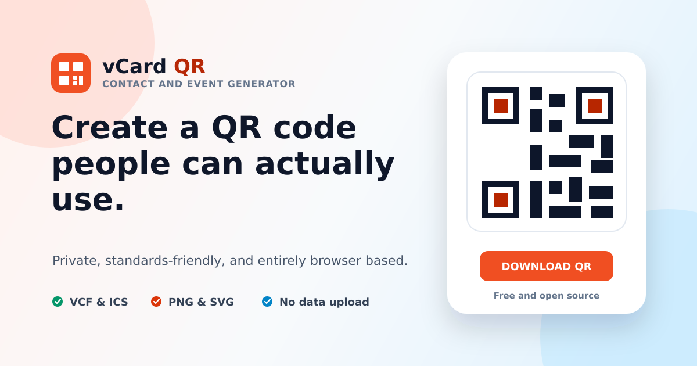

# vCard & Event QR Code Generator

[](https://github.com/mralexgarrido/vCard-Generator/actions/workflows/ci.yml)
[](https://github.com/mralexgarrido/vCard-Generator/actions/workflows/pages.yml)
[](LICENSE)

A free, privacy-first web app for creating vCard contact QR codes and iCalendar event QR codes.

[Open the live generator](https://mralexgarrido.github.io/vCard-Generator/)



## Why this generator is useful

- **Private by design.** Contact and event details are processed entirely in the browser.
- **No account or tracking.** The app has no sign-in, analytics, database, or server-side processing.
- **Two practical workflows.** Create a contact card or a calendar event from one interface.
- **Import and edit.** Load common VCF contact files or ICS calendar files without uploading them.
- **Automatic draft recovery.** Return to the latest contact and event drafts after closing the tab or browser.
- **Flexible exports.** Export QR codes as PNG or print-ready SVG, download the source VCF or ICS file, or copy its contents.
- **Safe QR customization.** Choose from high-contrast colors, three resilience levels, and multiple PNG sizes.
- **Standards-friendly output.** Text is escaped, UTF-8 content lines are folded, and files use CRLF line endings.
- **Time-zone aware events.** Local event times are converted to UTC, with quick durations and optional calendar reminders.
- **Built for real distribution.** Downloads include a white quiet zone, payload-size guidance, and accessible validation.

## Use the app

1. Choose **Contact** or **Event**.
2. Enter the information people should save, or import an existing VCF or ICS file.
3. For events, choose a quick duration and optional calendar reminder.
4. Open **QR appearance and export** to select a safe color, resilience level, and PNG size.
5. Resolve any message beneath the QR preview.
6. Test-scan the code with at least one iOS and one Android device.
7. Download PNG for digital use, SVG for print, VCF/ICS for direct file sharing, or copy the source data.

QR recognition differs among camera and scanner apps. Always test the final asset at its intended printed size before distributing it widely.

### Browser storage and privacy

The generator automatically stores the latest contact draft, event draft, selected workflow, and save time in the browser's local storage. This allows accidental tab closures and later visits to recover the most recent work without an account. Changes are saved after a short pause and again when the page is hidden or closed.

Saved drafts are scoped to this site's browser origin and the current browser profile. They are not uploaded, synced to another browser or device, or available to the project maintainer. On a shared computer, use **Forget saved data** to reset both forms and remove the stored record. Clearing browser site data also removes the draft.

## Run locally

### Requirements

- Node.js 20 or newer
- npm

### Setup

```bash
git clone https://github.com/mralexgarrido/vCard-Generator.git
cd vCard-Generator
npm ci
npm run dev
```

Vite serves the app at the local URL shown in the terminal.

### Quality checks

```bash
npm run check
```

This runs TypeScript checking, unit tests, and a production build.

## Architecture

| Area | Implementation |
| --- | --- |
| Interface | React 19 and TypeScript |
| Build | Vite |
| Styling | Tailwind CSS compiled at build time |
| QR rendering | `react-qr-code` |
| Contact format | vCard 3.0 |
| Event format | iCalendar 2.0 |
| File import | Common UTF-8 VCF and ICS fields, parsed locally |
| Hosting | GitHub Pages through GitHub Actions |
| Draft recovery | Versioned browser `localStorage` with validated restoration |
| Data handling | Local browser processing and storage only |

The project intentionally has no backend, cookies, telemetry, cloud database, or runtime API dependency.

## Standards references

- [RFC 2425: A MIME Content-Type for Directory Information](https://www.rfc-editor.org/rfc/rfc2425)
- [RFC 2426: vCard MIME Directory Profile](https://www.rfc-editor.org/rfc/rfc2426)
- [RFC 5545: Internet Calendaring and Scheduling Core Object Specification](https://www.rfc-editor.org/rfc/rfc5545)

## GitHub Pages deployment

The deployment workflow runs after a commit reaches `main` or when it is started manually.

For a new fork:

1. Open **Settings > Pages**.
2. Under **Build and deployment**, choose **GitHub Actions** as the source.
3. Push to `main` or run **Deploy to GitHub Pages** from the Actions tab.

The workflow calculates the correct repository subpath automatically, so forks do not need to edit Vite's base path.

## Contributing

Bug reports and focused improvements are welcome. Read [CONTRIBUTING.md](CONTRIBUTING.md) before opening a pull request. Please report security concerns according to [SECURITY.md](SECURITY.md).

## License

Released under the [MIT License](LICENSE).
